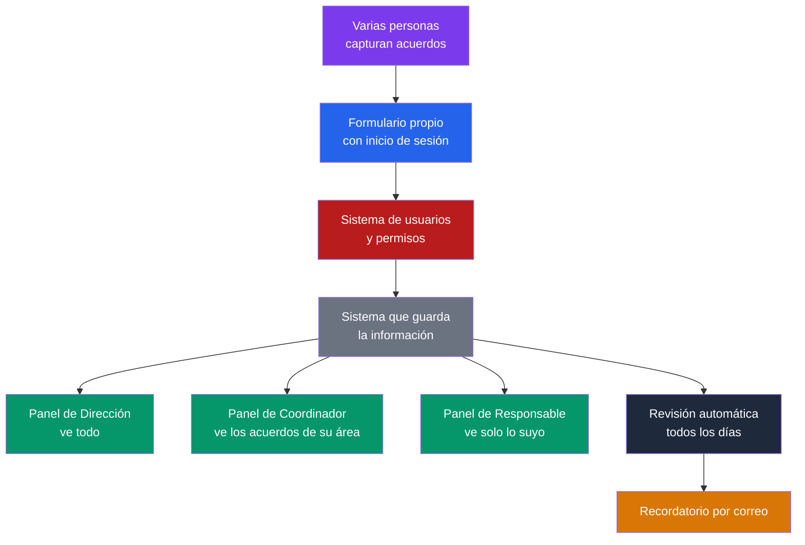

# Propuesta: aplicación propia para el seguimiento de acuerdos y recordatorios automáticos

*Preparado para la reunión de dirección del próximo miércoles.*
*Versión 5 — enfocada únicamente en la aplicación propia, con roles, permisos y captura por varias personas.*

---

## 1. De dónde partimos

En la sesión pasada quedamos de acuerdo en dejar de escribir minutas completas y narradas. De ahora en adelante solo se anota lo que sea un **acuerdo**, usando el formato que está preparando Mariel (tema, acuerdo, responsable, fecha compromiso, estado y observaciones).

A partir de ahí, se definió construir una aplicación propia, hecha a la medida para este proceso, que resuelva tres cosas importantes desde el diseño:

1. **La captura no depende de una sola persona.** Cualquier persona autorizada puede anotar un acuerdo, sin importar quién esté en turno ese día.
2. **Cada persona ve solo lo que le corresponde.** Un sistema de roles y permisos separa lo que ve un director, un coordinador de área y la persona responsable de un compromiso específico.
3. **Varias personas pueden capturar acuerdos distintos al mismo tiempo**, sin que eso genere errores ni se pierda información.

## 2. Cómo va a funcionar

Cada persona entra con su propia cuenta y anota el acuerdo en el formulario, en el momento en que se pacta. La información se guarda en un solo sistema, y a partir de ahí cada quien ve un panel distinto según su rol: la dirección ve todo, un coordinador ve lo de su área, y cada responsable ve únicamente sus propios pendientes. Todos los días, el sistema revisa las fechas compromiso por su cuenta y manda el recordatorio por correo a quien corresponda, sin que nadie tenga que estar checando manualmente.

## 3. Roles y permisos propuestos

| Rol | Quién sería (ejemplo) | Qué ve | Qué puede hacer |
|---|---|---|---|
| **Dirección** | Dirección de Plan Juárez / PEJ | Todos los acuerdos, de todas las áreas | Ver todo, generar reportes generales, dar de alta o baja usuarios |
| **Coordinador de área** | Ej. Mariel, Elizabeth, Diego, según el área o proyecto | Los acuerdos de su área o proyecto | Ver y actualizar el estatus de los acuerdos de su área |
| **Responsable de un compromiso** | Cualquier persona con un acuerdo asignado | Únicamente los compromisos donde ella es la responsable | Ver sus pendientes y marcar su propio avance o estatus |

Estos tres roles son una propuesta inicial — se pueden ajustar en la reunión según cómo esté organizado realmente el equipo.

## 4. Captura por varias personas, al mismo tiempo

El sistema está pensado para que cualquier persona con acceso pueda capturar un acuerdo en el momento en que se pacta, sin importar quién lo haga cada vez. Cada acuerdo se guarda como un registro independiente, así que no hay riesgo de que dos personas "choquen" si están anotando cosas distintas al mismo tiempo — es lo mismo que pasa cuando varias personas mandan un correo al mismo tiempo: cada uno llega por su lado, sin pisar al del otro.

## 5. Recordatorios automáticos

Cada acuerdo tiene una fecha compromiso. El sistema revisa esas fechas todos los días por su cuenta, sin que nadie tenga que entrar a checar, y manda un correo a la persona responsable cuando se acerca o se vence su fecha. La dirección y los coordinadores pueden, además, recibir un resumen periódico de los pendientes de su área.

## 6. Cómo se construye

Esta aplicación la construye **Claude Code** — la misma inteligencia artificial, pero usada como programador — y ya se cuenta con dónde alojarla (hosting) y con todo lo demás que se necesita para tenerla funcionando. Esto quiere decir que no hay que contratar desarrollo externo ni pagar servicios nuevos para poder construirla.

## 7. Plan de trabajo propuesto

| Fase | Qué incluye | Tiempo estimado |
|---|---|---|
| 0. Diseño y validación | Confirmar el formato final de captura y los roles con el equipo | 3–5 días |
| 1. Captura e inicio de sesión | Formulario de acuerdos + cuentas de usuario básicas | 1 semana |
| 2. Panel personalizado por rol | Vistas de Dirección, Coordinador y Responsable | 1–2 semanas |
| 3. Recordatorios automáticos | Revisión diaria de fechas y envío de correos | 3–5 días |
| 4. Pruebas con datos reales | Ajustes con 2–3 reuniones reales antes de usarlo de forma definitiva | 3–5 días |

**Tiempo total estimado: 4 a 5 semanas**, de inicio a una versión ya probada con datos reales.

## 8. Lo que hay que decidir en esta reunión

- ¿Los tres roles propuestos (Dirección, Coordinador, Responsable) reflejan cómo está organizado el equipo, o hay que ajustarlos?
- ¿Quién queda como Dirección/Administración del sistema, con permiso para dar de alta a nuevos usuarios?
- ¿Con qué reuniones se va a probar primero (Fase 4), antes de usarlo de forma definitiva?
- ¿Conectamos desde ahora esto con el tablero de metas estratégicas que ya existe, o lo dejamos para una segunda fase, como ya se había platicado?
