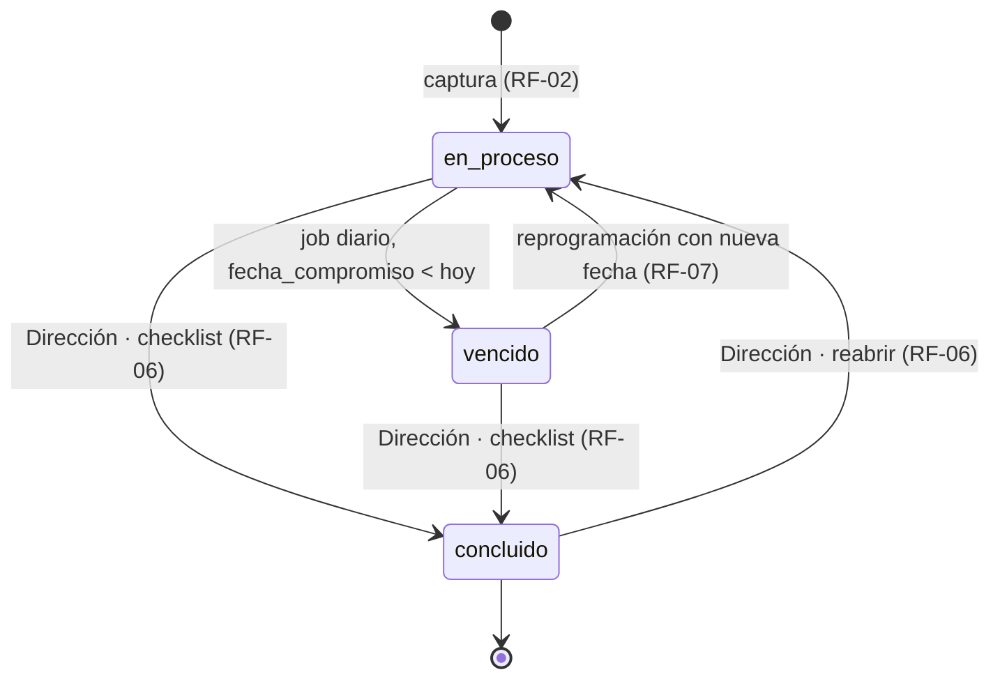

# 01 — SRS · Especificación de Requisitos de Software

| Campo | Valor |
|---|---|
| Documento | 01 — SRS (ISO/IEC/IEEE 29148:2018) |
| Versión | 1.0 (borrador — se re-sincroniza tras validar el demo React, paso 14 del proceso) |
| Fecha | 2026-07-08 |
| Depende de | 00_auditoria_fuentes, ADR-001/002/003 |

## 1. Introducción

### 1.1 Propósito
Especificar los requisitos del Panel de Acuerdos: captura estructurada de acuerdos de reuniones, seguimiento por roles con corresponsables, recordatorios automáticos personalizables por correo y sincronización con Google Calendar.

### 1.2 Alcance del MVP
Incluye: autenticación Firebase, CRUD de acuerdos con captura por lote (formularios y hoja), corresponsables, panel con 5 vistas (tabla, tarjetas/kanban, por reunión, cronograma/gantt, **calendario**), checklist de validación para Dirección, avances/observaciones, recordatorios configurables con envío por Gmail API, calendario compartido de Google, administración de usuarios y resumen periódico. Excluye (post-MVP): Google Tasks por usuario, integración con tablero de metas estratégicas (H-10), reportes exportables, app móvil.

### 1.3 Glosario

| Término | Definición |
|---|---|
| Acuerdo | Compromiso pactado en reunión: tema, acción, responsable, corresponsables, área, fecha compromiso, estado |
| Responsable | Único usuario dueño del cumplimiento del acuerdo |
| Corresponsable | Usuario adicional (0..N) con seguimiento completo del acuerdo, sin poder concluirlo |
| Concluir | Cambio a estado `concluido`; acción exclusiva de Dirección desde el checklist |
| Reprogramar | Registrar un avance que fija nueva fecha compromiso; si estaba `vencido` regresa a `en_proceso` |
| Recordatorio | Correo automático derivado de la fecha compromiso (previos, día D, seguimiento de vencido) |
| Área | Unidad organizativa (p. ej. Coordinación operativa) que agrupa acuerdos y define el ámbito de una coordinación |

### 1.4 Stack
Ver ADR-001: React 19/Vite/Tailwind 4 + CI4 4.7 + MySQL 8.4 + Redis 7 + Firebase Auth + Google APIs.

## 2. Descripción general

### 2.1 Perspectiva
SPA React contra API REST CI4. Job diario (cron, TZ America/Ciudad_Juarez) para estados y recordatorios. Sistema nuevo; convive con Google Workspace de la organización.

### 2.2 Roles

| Rol | Ve | Puede |
|---|---|---|
| **Dirección** | Todos los acuerdos y áreas | Todo lo de coordinación +: **concluir/reabrir** acuerdos (checklist), administrar usuarios y áreas, editar configuración global de recordatorios, ver resumen general |
| **Coordinación de área** | Acuerdos de su área + aquellos donde es responsable o corresponsable | Capturar, editar campos de acuerdos de su área, registrar avances, reprogramar, gestionar corresponsables, ver resumen de su área |
| **Responsable** | Acuerdos donde es responsable **o corresponsable** | Capturar, registrar avances y reprogramar en sus acuerdos, editar observaciones/enlace propios |

Matriz de autorización fina (fuente de verdad para Policies y pruebas):

| Acción | Dirección | Coordinación (su área) | Responsable/Corresponsable (su acuerdo) | Otros |
|---|---|---|---|---|
| Ver acuerdo | ✅ | ✅ | ✅ | ❌ 403 |
| Capturar acuerdos | ✅ | ✅ | ✅ | — |
| Editar tema/acción/área/responsable/corresponsables | ✅ | ✅ | ❌ | ❌ |
| Registrar avance / observaciones / enlace | ✅ | ✅ | ✅ | ❌ |
| Reprogramar fecha compromiso | ✅ | ✅ | ✅ | ❌ |
| **Concluir / reabrir** | ✅ | ❌ 403 | ❌ 403 | ❌ 403 |
| Administrar usuarios/áreas/config | ✅ | ❌ | ❌ | ❌ |

### 2.3 Suposiciones y dependencias
Google Workspace activo con posibilidad de habilitar Gmail/Calendar APIs y domain-wide delegation; proyecto Firebase disponible; hosting con PHP 8.3, MySQL y Redis (Docker en desarrollo); usuarios con correo del dominio o correo verificado.

## 3. Requisitos funcionales

### RF-01 · Autenticación y sesión
1. Login con Google (dominio) y con email/password vía Firebase (ADR-002).
2. Solo usuarios existentes en la tabla local y `activo=1` acceden; de lo contrario 403 `usuario_no_registrado`.
3. `GET /me` devuelve identidad, rol y área.
4. Autorregistro (ADR-006): cualquier portador de un ID token Firebase válido puede darse de alta vía `POST /registro` sin depender de un alta manual previa. La cuenta nace con rol `pendiente` — existe pero sin acceso funcional (403 `cuenta_pendiente` en todo endpoint salvo `GET/PATCH /me`) — hasta que Dirección le asigna uno de los tres roles operativos vía `PATCH /usuarios/{id}`.
**Criterios de aceptación:** token inválido/expirado → 401; usuario desactivado → 403 en ≤60 s; primer login enlaza `firebase_uid` por email verificado; una cuenta recién autorregistrada (`pendiente`) puede consultar/editar su propio nombre en `/me` pero recibe 403 en cualquier otro endpoint hasta la aprobación de Dirección.

### RF-02 · Captura de acuerdos (lote)
1. Dos vistas intercambiables idénticas al demo: *Formularios* (bloques repetibles) y *Hoja de captura* (cuadrícula).
2. Campos: tema (opcional), acción*, responsable*, corresponsables (0..N), área*, fecha compromiso*, enlace (opcional), observaciones (opcional). **No existe campo de estado**: todo acuerdo nace `en_proceso` (H-01). Un corresponsable **no puede ser** el responsable del mismo acuerdo (la API lo rechaza con 422; evita duplicar destinatarios de recordatorios).
3. Guardado de todo el lote en una transacción; validación por renglón/bloque resaltando incompletos.
4. Se registra reunión de origen (por defecto la del día), quién capturó, y se programan recordatorios y evento de calendario.
**Criterios:** lote con un renglón inválido no persiste nada (todo-o-nada); respuesta incluye ids creados; captura concurrente de usuarios distintos no interfiere.

### RF-03 · Panel de seguimiento
1. Cinco modos: **Tabla**, **Tarjetas (kanban 2 columnas: En proceso, Vencido — Concluido aparece solo al filtrar)**, **Por reunión**, **Cronograma (gantt)** y **Calendario** (RF-04).
2. Tarjetas de estadísticas sobre lo visible: En proceso, Vencidos, Por vencer (≤7 días), Concluidos.
3. Filtros: estado, responsable, búsqueda de texto (tema+acción+responsable). **Default: los `concluido` se ocultan**; solo se muestran al filtrar explícitamente por estado Concluido (requisito de dirección).
4. Visibilidad por rol según §2.2.
5. Detalle en drawer lateral: datos completos, corresponsables, avances, recordatorios del acuerdo, acciones según permisos.
**Criterios:** un responsable nunca recibe en la respuesta acuerdos ajenos (filtrado server-side); contador "Mostrando X de Y".

### RF-04 · Vista calendario
1. Rejilla mensual con los acuerdos visibles ubicados en su fecha compromiso, con punto de color por estado y navegación mes anterior/siguiente/hoy.
2. Día con >3 acuerdos colapsa a "+N más"; clic abre el drawer del acuerdo.
3. Refleja los mismos filtros del panel.
**Criterios:** los días se calculan en TZ America/Ciudad_Juarez; los concluidos solo aparecen si el filtro los incluye.

### RF-05 · Máquina de estados (ver §7)
1. Estados: `en_proceso` (default), `vencido`, `concluido`.
2. `vencido` lo asigna exclusivamente el sistema cuando `fecha_compromiso < hoy` y el estado es `en_proceso` (job diario + salvaguarda derivada en lectura).
3. Reprogramación (avance con nueva fecha futura) regresa `vencido → en_proceso`.
4. `concluido` solo Dirección (RF-06); reabrir (Dirección) regresa a `en_proceso` y recalcula vencimiento.
**Criterios:** API rechaza con 422 cualquier intento de escribir `vencido`, y con 403 un `concluido` de rol no autorizado.

### RF-06 · Checklist de validación (Dirección)
1. Vista exclusiva de Dirección que lista acuerdos abiertos (prioriza vencidos y próximos a vencer) con toda la evidencia: avances, enlace a productos, corresponsables.
2. Acción "Marcar como concluido" por renglón (checkbox/botón) con confirmación; registra quién y cuándo (`concluido_por`, `concluido_at`) y opcionalmente nota de validación.
3. Permite reabrir un concluido (con nota), regresándolo a `en_proceso`.
4. Al concluir: se cancelan recordatorios futuros y se actualiza el evento de calendario.
**Criterios:** acción visible solo para Dirección; auditoría completa del cambio; concluidos desaparecen del panel default de inmediato.

### RF-07 · Avances y seguimiento
1. Responsable, corresponsables y coordinación del área registran avances (texto) sobre el acuerdo; opcionalmente con reprogramación de fecha.
2. El historial de avances es inmutable (no se edita ni borra; correcciones = nuevo avance).
**Criterios:** la reprogramación exige `nueva_fecha >= hoy` (TZ Juárez); `nueva_fecha == hoy` es válida y regresa el acuerdo a `en_proceso`. Avance con fecha estrictamente pasada (`< hoy`) → 422; avance en acuerdo `concluido` → 409.

### RF-08 · Recordatorios personalizables
1. Configuración global (edita Dirección): lista de días de anticipación (ej. `[7,3,1]`), incluir aviso del día D (sí/no), seguimiento de vencido cada N días hasta M repeticiones.
2. Override por acuerdo: al capturar/editar se puede definir un esquema propio (`recordatorio_dias`); si es nulo aplica el global.
3. Destinatarios: responsable + corresponsables; resumen periódico a Dirección (general) y coordinaciones (su área) con frecuencia configurable.
4. El job diario materializa y envía por Gmail API, registrando cada envío (destinatario, tipo, `gmail_message_id`, estado, error).
5. UI de recordatorios idéntica al demo: próximos envíos + historial + vista previa del correo.
**Criterios:** cambiar el default global no reescribe overrides; acuerdo concluido no genera envíos; reprogramar regenera los futuros y cancela los obsoletos; ningún duplicado por (acuerdo, destinatario, tipo, fecha). Los recordatorios se materializan siempre de forma **prospectiva** (a partir de hoy): reprogramar a una fecha ya pasada no genera envíos retroactivos.

### RF-09 · Sincronización Google Calendar
1. Cada acuerdo genera/actualiza un evento all-day en el calendario compartido "Acuerdos · Plan Juárez" (título: `[Tema] Acción — Responsable`).
2. Reprogramación mueve el evento; conclusión lo marca `[Concluido]` con color neutro.
3. Sincronización idempotente con reintentos; errores visibles para Dirección.
**Criterios:** borrar el acuerdo elimina el evento; no se crean eventos duplicados.

### RF-10 · Administración de usuarios y áreas (Dirección)
1. Alta/baja (desactivación) de usuarios con nombre, email, rol y área; alta/edición de áreas.
2. La baja es lógica: conserva historial y bloquea acceso en ≤60 s.
**Criterios:** no se puede desactivar al último usuario Dirección activo (422); email único.

### RF-11 · Resumen periódico
1. Vista/correo resumen: totales por estado, vencidos y próximos, agrupado general (Dirección) o por área (coordinación), equivalente al modal del demo.
**Criterios:** cifras coinciden con el panel bajo los mismos filtros de visibilidad.

### RF-12 · Auditoría
1. Se registra: login, creación/edición de acuerdos, cambios de estado, envíos, cambios de configuración y de usuarios (quién, qué, cuándo, desde qué IP).
**Criterios:** conclusión y reapertura siempre auditadas con nota.

## 4. Requisitos no funcionales

| Categoría | Requisito |
|---|---|
| Rendimiento | p95 < 500 ms en listados con ≤5,000 acuerdos; panel inicial < 2 s en 4G; job diario < 5 min |
| Seguridad | Doc 04: OWASP Top 10, RBAC server-side, cifrado de tokens Google en reposo, HTTPS forzado |
| Escalabilidad | ~20 usuarios y ~100 acuerdos/mes hoy; diseño soporta 10× sin cambios (índices doc 03) |
| Disponibilidad | Objetivo 99% mensual; job de recordatorios re-ejecutable e idempotente ante fallas |
| Usabilidad | 1:1 con demo aprobado; WCAG 2.1 AA; responsive ≥360 px; español mexicano |
| Privacidad | LFPDPPP: datos mínimos (nombre, correo), baja lógica, sin PII en logs |
| Zona horaria | Toda lógica de fechas en America/Ciudad_Juarez |

## 5. Restricciones técnicas
Hosting PHP existente; Google Workspace del dominio; sin costos de servicios nuevos (Firebase Spark, cupos gratuitos de Google APIs); repositorio único (monorepo docs + demo-ux + apps).

## 6. Criterios de aceptación del MVP
(1) Los 3 roles operan sus flujos completos con datos reales de 2–3 reuniones (Fase 4 de la propuesta); (2) recordatorios reales recibidos según esquema configurado; (3) eventos visibles en el calendario compartido; (4) solo Dirección puede concluir — verificado con prueba negativa; (5) concluidos ocultos por defecto; (6) checklist DoD Fase 2 (Gobernanza v3) verificada.

## 7. Máquina de estados del acuerdo

| Transición | Actor | Guarda / efecto |
|---|---|---|
| → `en_proceso` | Captura | Estado inicial único; programa recordatorios y evento |
| `en_proceso` → `vencido` | Sistema (job) | `fecha_compromiso < hoy(TZ Juárez)`; activa seguimiento de vencido |
| `vencido` → `en_proceso` | Responsable/corresponsable/coordinación | Requiere avance con `nueva_fecha > hoy`; regenera recordatorios y mueve evento |
| `en_proceso|vencido` → `concluido` | **Solo Dirección** | Registra `concluido_por/at`; cancela recordatorios; marca evento |
| `concluido` → `en_proceso` | **Solo Dirección** | Nota obligatoria; recalcula vencido; reactiva recordatorios |

## 8. Consideraciones futuras (fuera del MVP)
Google Tasks por usuario (ADR-003); integración con tablero de metas estratégicas (H-10); attendees nativos en eventos; reportes PDF/XLSX; notificaciones push; recordatorios por WhatsApp evaluables solo con decisión de dirección.
