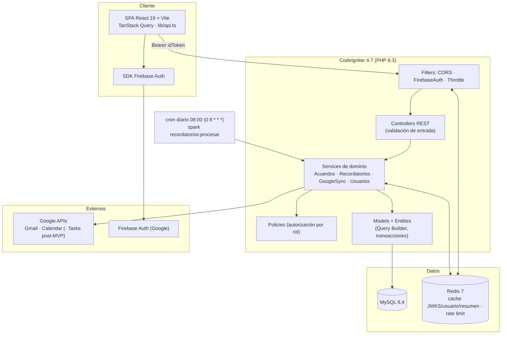
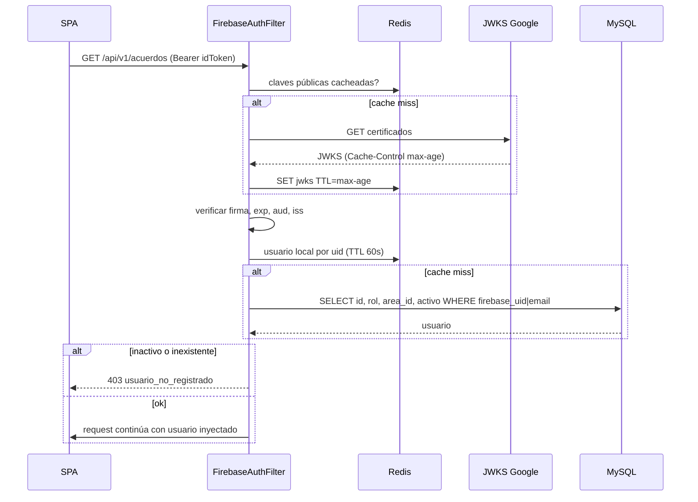
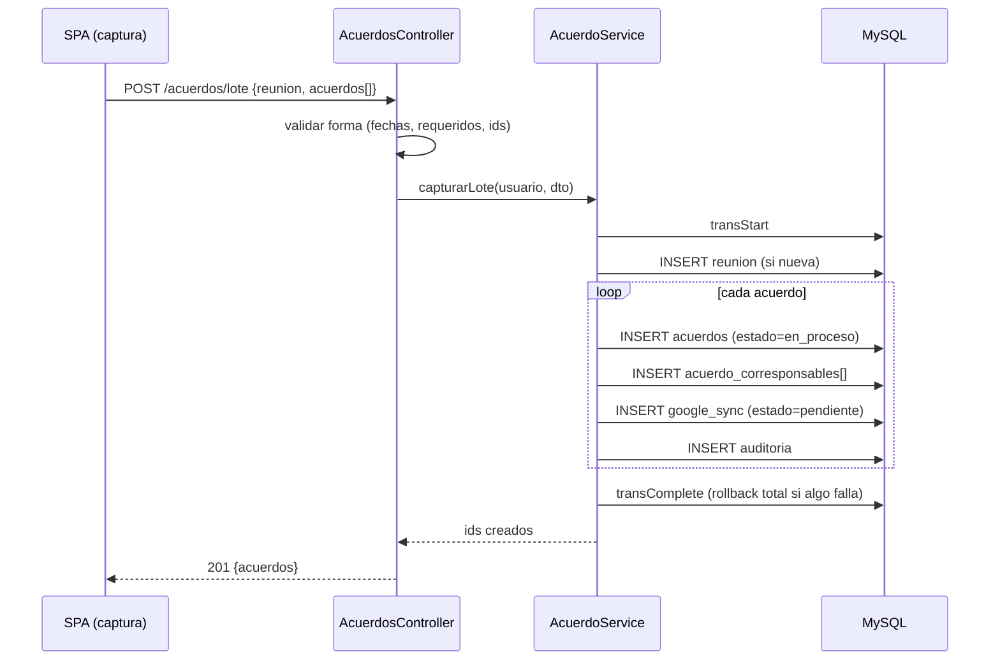
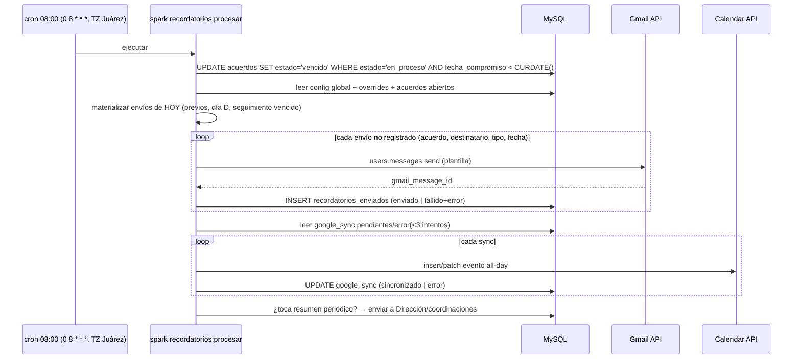
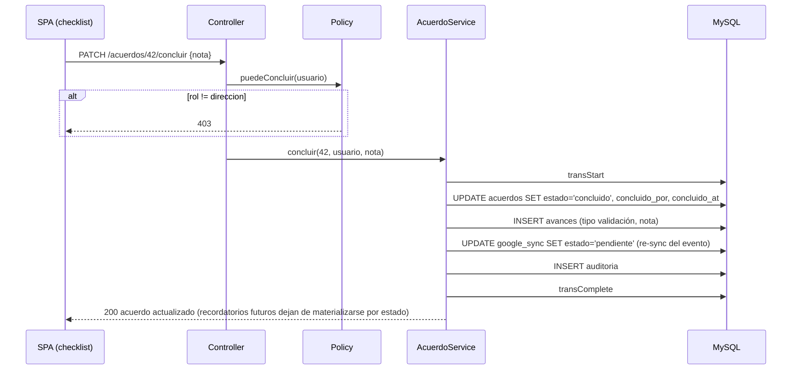

# 02 — Arquitectura del Sistema

| Campo | Valor |
|---|---|
| Documento | 02 — Arquitectura del Sistema |
| Versión | 1.0 |
| Fecha | 2026-07-08 |
| Depende de | 01_SRS, ADR-001/002/003 |

## 1. Principios rectores

1. **Frontend promovible sin retrabajo** — el demo React es el frontend de producción; el origen de datos (mock↔API) se cambia detrás de `lib/api.ts` (Demo-First v2). *Justificación:* elimina la reescritura que históricamente duplicaba el costo de los prototipos.
2. **Autorización en el servidor, siempre** — el front oculta UI; el backend decide. Toda regla de §2.2 del SRS vive en Services de CI4 con prueba negativa. *Justificación:* el demo tenía permisos en JS (H-04); en producción eso es solo cosmética.
3. **Estados derivados los calcula el sistema** — `vencido` nunca viene del cliente; el job lo persiste y la capa de lectura lo deriva como salvaguarda. *Justificación:* consistencia temporal y auditoría limpia.
4. **Idempotencia en todo lo externo** — recordatorios y sincronización de Calendar se pueden re-ejecutar sin duplicar (claves naturales + registro de envíos). *Justificación:* los cron fallan; recuperarse debe ser gratis.
5. **Seguridad por diseño** — filtros CORS/auth/throttle antes que controladores; secretos fuera del repo; TZ única. *Justificación:* doc 04 y lecciones de Portal BQS.

## 2. Estilo arquitectónico

Monolito API REST en capas (CI4) + SPA desacoplada. Justificación: un dominio pequeño y cohesivo (~10 tablas), un equipo, un hosting PHP; microservicios o SSR agregarían operación sin beneficio. La asincronía se resuelve con un job diario y colas ligeras sobre tablas (estado `pendiente/error` en `google_sync`), no con brokers.

## 3. Diagrama de capas



## 4. Descripción de capas

| # | Capa | Responsabilidad |
|---|---|---|
| 1 | Presentación (SPA) | Pantallas 1:1 del demo + nuevas vistas; estado de servidor con TanStack Query; nunca contiene reglas de autorización reales |
| 2 | Cliente de API (`lib/api.ts`) | Interfaz `ApiClient` congelada (doc 05); implementaciones mock/real intercambiables |
| 3 | Borde (Filters) | CORS estricto por origen, verificación Firebase (ADR-002), rate limiting con Redis |
| 4 | Controladores | Mapear HTTP↔dominio; validación de forma (reglas de CI4), sin lógica de negocio |
| 5 | Autorización (Policies) | Matriz SRS §2.2; lanzan 403; probadas negativamente |
| 6 | Servicios de dominio | Casos de uso: capturar lote, avanzar/reprogramar, concluir/reabrir, materializar recordatorios, sincronizar calendario |
| 7 | Persistencia (Models/Entities) | Query Builder con binding; eager loading agrupado (cero N+1); transacciones |
| 8 | Datos | MySQL (fuente de verdad), Redis (derivados y throttling; nunca fuente de verdad) |
| 9 | Integraciones | `GmailService`, `GoogleCalendarService` (service account, scopes mínimos), adaptadores idempotentes |
| 10 | Auditoría/observabilidad | Tabla `auditoria`, logs estructurados de CI4, registro de envíos y errores de sync |

## 5. Flujos críticos

### 5.1 Autenticación de request



### 5.2 Captura de lote (transaccional)



### 5.3 Job diario de recordatorios y vencidos



### 5.4 Conclusión desde el checklist



## 6. Patrones de implementación

**Filter de autenticación (borde):**

```php
<?php
declare(strict_types=1);

namespace App\Filters;

use CodeIgniter\Filters\FilterInterface;
use CodeIgniter\HTTP\RequestInterface;
use CodeIgniter\HTTP\ResponseInterface;
use App\Services\FirebaseTokenVerifier;
use App\Models\UsuarioModel;

final class FirebaseAuthFilter implements FilterInterface
{
    public function before(RequestInterface $request, $arguments = null)
    {
        $header = $request->getHeaderLine('Authorization');
        if (! str_starts_with($header, 'Bearer ')) {
            return service('response')->setJSON(['error' => 'token_requerido'])->setStatusCode(401);
        }

        try {
            $claims = service('firebaseVerifier')->verify(substr($header, 7)); // firma+exp+aud+iss, JWKS en Redis
        } catch (\App\Exceptions\TokenInvalidoException) {
            return service('response')->setJSON(['error' => 'token_invalido'])->setStatusCode(401);
        }

        $usuario = cache()->remember('usr:' . $claims->uid, 60, static fn ()
            => model(UsuarioModel::class)->porFirebaseUidOEmail($claims->uid, $claims->email, $claims->emailVerified));

        if ($usuario === null || ! $usuario->activo) {
            return service('response')->setJSON(['error' => 'usuario_no_registrado'])->setStatusCode(403);
        }

        $request->usuario = $usuario; // disponible para Controllers/Policies
        return $request;
    }

    public function after(RequestInterface $request, ResponseInterface $response, $arguments = null) {}
}
```

**Policy + servicio (conclusión, regla №4 de CLAUDE.md):**

```php
<?php
declare(strict_types=1);

namespace App\Services;

use App\Entities\Usuario;
use App\Exceptions\ProhibidoException;
use App\Exceptions\EstadoInvalidoException;

final class AcuerdoService
{
    public function __construct(private readonly \CodeIgniter\Database\BaseConnection $db) {}

    public function concluir(int $acuerdoId, Usuario $actor, string $nota): void
    {
        if ($actor->rol !== 'direccion') {
            throw new ProhibidoException('solo_direccion_concluye'); // → 403
        }

        $this->db->transException(true)->transStart();

        $acuerdo = $this->db->table('acuerdos')->where('id', $acuerdoId)->get()->getRow();
        if ($acuerdo === null || $acuerdo->estado === 'concluido') {
            throw new EstadoInvalidoException('acuerdo_no_concluible'); // → 409
        }

        $this->db->table('acuerdos')->where('id', $acuerdoId)->update([
            'estado'           => 'concluido',
            'concluido_por_id' => $actor->id,
            'concluido_at'     => date('Y-m-d H:i:s'),
        ]);
        $this->db->table('avances')->insert([
            'acuerdo_id' => $acuerdoId, 'usuario_id' => $actor->id,
            'tipo' => 'validacion', 'descripcion' => $nota,
        ]);
        $this->db->table('google_sync')->where('acuerdo_id', $acuerdoId)->update(['estado' => 'pendiente']);
        $this->db->table('auditoria')->insert([
            'usuario_id' => $actor->id, 'accion' => 'concluir',
            'entidad' => 'acuerdo', 'entidad_id' => $acuerdoId,
            'detalle' => json_encode(['nota' => $nota], JSON_UNESCAPED_UNICODE),
        ]);

        $this->db->transComplete();
    }
}
```

**Cliente de API en el front (interfaz única):**

```typescript
// lib/index.ts — el interruptor mock/real (Demo-First v2)
import type { ApiClient } from './api';
import { mockClient } from './api.mock';
import { realClient } from './api.real';

export const api: ApiClient =
  import.meta.env.VITE_USE_MOCK === 'true' ? mockClient : realClient;
```

## 7. Estrategia de despliegue

Desarrollo: `docker compose up -d` (mysql:8.4, redis:7) + `php spark serve` + `npm run dev` con `VITE_USE_MOCK` a elección. Producción: build de Vite servido como estáticos (mismo dominio que la API o CORS restringido), CI4 detrás del webserver del hosting con HTTPS forzado, `.env` de producción con credenciales (Firebase project, service account Google), cron del sistema (el cron corre a las 08:00, America/Ciudad_Juarez: `0 8 * * *`): `0 8 * * * php /ruta/spark recordatorios:procesar >> log 2>&1`. Migraciones con `php spark migrate`; datos iniciales con `InitialSeeder` (siembra desde `db.json`).

## 8. Decisiones pendientes y riesgos

| Riesgo / pendiente | Mitigación |
|---|---|
| Cuenta central de correo por definir (`acuerdos@planjuarez.org`) | Decidir con Dirección antes del Sprint 1 de Fase 2 |
| Domain-wide delegation requiere superadmin Workspace | Gestionarlo en Sprint 0 de Fase 2; alternativa: refresh token OAuth de la cuenta central |
| Cambio de esquema de recordatorios con envíos ya materializados | Los envíos registrados son historial inmutable; solo se recalculan futuros |
| Hosting sin Redis | Docker en el VPS; si el hosting final no lo permite, CI4 cae a handler de cache `file` sin cambio de código (config) |
