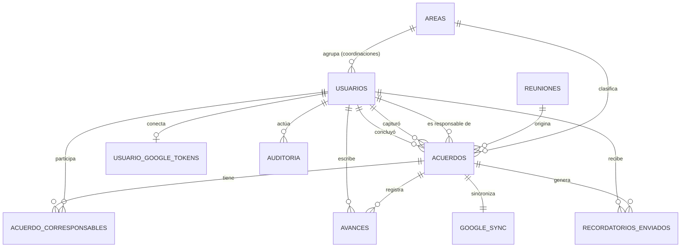

# 03 — Modelo de Datos

| Campo | Valor |
|---|---|
| Documento | 03 — Modelo de Datos |
| Versión | 1.0 |
| Fecha | 2026-07-08 |
| Depende de | 01_SRS, 02_arquitectura, ADR-002/003 |

> **Este DDL es la fuente de verdad.** `demo-ux/app/src/lib/mock/db.json` debe espejarlo exactamente (tablas, columnas, enums, FKs) y se verifica ejecutablemente antes de cerrar el Sprint D (Gobernanza v3 §5).

## 1. ERD



## 2. Diccionario de datos

### `areas`
| Columna | Tipo | Null | Notas |
|---|---|---|---|
| id | INT UNSIGNED AI PK | No | |
| nombre | VARCHAR(120) | No | UNIQUE |
| activa | TINYINT(1) | No | default 1 |
| created_at / updated_at | DATETIME | No / Sí | |

### `usuarios`
| Columna | Tipo | Null | Notas |
|---|---|---|---|
| id | INT UNSIGNED AI PK | No | |
| firebase_uid | VARCHAR(128) | Sí | UNIQUE; null hasta el primer login (ADR-002) |
| nombre | VARCHAR(120) | No | |
| email | VARCHAR(160) | No | UNIQUE; lista blanca de acceso |
| rol | ENUM('direccion','coordinador','responsable') | No | RBAC (SRS §2.2) |
| area_id | INT UNSIGNED FK→areas | Sí | Obligatorio solo para rol coordinador (CHECK) |
| activo | TINYINT(1) | No | default 1; baja lógica (RF-10) |
| created_at / updated_at | DATETIME | No / Sí | |

### `reuniones`
| Columna | Tipo | Null | Notas |
|---|---|---|---|
| id | INT UNSIGNED AI PK | No | |
| nombre | VARCHAR(160) | No | ej. "Reunión de dirección · 8 de julio" |
| fecha | DATE | No | UNIQUE(nombre, fecha) |
| created_at | DATETIME | No | |

### `acuerdos`
| Columna | Tipo | Null | Notas |
|---|---|---|---|
| id | INT UNSIGNED AI PK | No | |
| reunion_id | INT UNSIGNED FK→reuniones | No | |
| area_id | INT UNSIGNED FK→areas | No | |
| tema | VARCHAR(160) | Sí | |
| accion | TEXT | No | qué se acordó hacer |
| responsable_id | INT UNSIGNED FK→usuarios | No | único responsable |
| capturado_por_id | INT UNSIGNED FK→usuarios | No | |
| fecha_compromiso | DATE | No | TZ Juárez |
| estado | ENUM('en_proceso','vencido','concluido') | No | default 'en_proceso' (RF-05); 'vencido' solo lo escribe el sistema |
| enlace | VARCHAR(2048) | Sí | URL a productos (límite HTTP estándar; cubre enlaces largos de Drive/Sheets) |
| observaciones | TEXT | Sí | |
| recordatorio_dias | JSON | Sí | override RF-08, ej. `[7,3,1]`; NULL = default global |
| concluido_por_id | INT UNSIGNED FK→usuarios | Sí | solo Dirección (RF-06) |
| concluido_at | DATETIME | Sí | |
| created_at / updated_at | DATETIME | No / Sí | |

### `acuerdo_corresponsables` (N:M, H-02)
| Columna | Tipo | Null | Notas |
|---|---|---|---|
| acuerdo_id | INT UNSIGNED FK→acuerdos | No | PK compuesta |
| usuario_id | INT UNSIGNED FK→usuarios | No | PK compuesta |
| created_at | DATETIME | No | |

### `avances` (historial inmutable, RF-07)
| Columna | Tipo | Null | Notas |
|---|---|---|---|
| id | INT UNSIGNED AI PK | No | |
| acuerdo_id | INT UNSIGNED FK→acuerdos | No | |
| usuario_id | INT UNSIGNED FK→usuarios | No | |
| tipo | ENUM('avance','reprogramacion','validacion','reapertura') | No | default 'avance' |
| descripcion | TEXT | No | |
| nueva_fecha | DATE | Sí | solo tipo reprogramacion |
| created_at | DATETIME | No | |

### `configuracion` (clave-valor, RF-08)
| Columna | Tipo | Null | Notas |
|---|---|---|---|
| clave | VARCHAR(60) PK | No | ej. `recordatorios_default` |
| valor | JSON | No | `{"dias_antes":[7,3,1],"dia_compromiso":true,"vencido_cada_dias":3,"vencido_max_repeticiones":5,"resumen_frecuencia":"semanal"}` |
| updated_at | DATETIME | Sí | |

### `recordatorios_enviados` (log inmutable, RF-08)
| Columna | Tipo | Null | Notas |
|---|---|---|---|
| id | INT UNSIGNED AI PK | No | |
| acuerdo_id | INT UNSIGNED FK→acuerdos | Sí | NULL para resúmenes periódicos |
| usuario_id | INT UNSIGNED FK→usuarios | No | destinatario |
| tipo | ENUM('previo','dia','vencido','resumen') | No | |
| programado_para | DATE | No | fecha lógica del aviso |
| enviado_at | DATETIME | Sí | NULL si falló |
| estado | ENUM('enviado','fallido') | No | |
| gmail_message_id | VARCHAR(64) | Sí | trazabilidad (ADR-003) |
| error | TEXT | Sí | |
| UNIQUE | (acuerdo_id, usuario_id, tipo, programado_para) | | anti-duplicados (idempotencia) |

### `google_sync` (evento de Calendar por acuerdo, RF-09)
| Columna | Tipo | Null | Notas |
|---|---|---|---|
| id | INT UNSIGNED AI PK | No | |
| acuerdo_id | INT UNSIGNED FK→acuerdos | No | UNIQUE (1:1) |
| calendar_event_id | VARCHAR(128) | Sí | id del evento en el calendario compartido |
| estado | ENUM('pendiente','sincronizado','error') | No | default 'pendiente' |
| intentos | TINYINT UNSIGNED | No | default 0; reintenta <3 |
| synced_at | DATETIME | Sí | |
| error | TEXT | Sí | |

### `usuario_google_tokens` (post-MVP Tasks, ADR-003; se crea desde el MVP para no migrar)
| Columna | Tipo | Null | Notas |
|---|---|---|---|
| id | INT UNSIGNED AI PK | No | |
| usuario_id | INT UNSIGNED FK→usuarios | No | UNIQUE |
| refresh_token_cifrado | TEXT | No | AES-256-GCM (`encrypt()` CI4) |
| scopes | VARCHAR(500) | No | |
| connected_at | DATETIME | No | |
| revoked_at | DATETIME | Sí | |

### `auditoria` (RF-12)
| Columna | Tipo | Null | Notas |
|---|---|---|---|
| id | BIGINT UNSIGNED AI PK | No | |
| usuario_id | INT UNSIGNED FK→usuarios | Sí | NULL = sistema (job) |
| accion | VARCHAR(60) | No | login, crear, editar, concluir, reabrir, config, alta_usuario… |
| entidad | VARCHAR(40) | No | acuerdo, usuario, configuracion… |
| entidad_id | INT UNSIGNED | Sí | |
| detalle | JSON | Sí | diff o nota; sin PII innecesaria |
| ip | VARCHAR(45) | Sí | IPv4/IPv6 |
| created_at | DATETIME | No | |

## 3. DDL completo (MySQL 8.4)

```sql
-- Panel de Acuerdos · Plan Juárez · DDL v1.0 (2026-07-08)
-- charset/collation y TZ: el servidor opera con time_zone = 'America/Ciudad_Juarez'
SET NAMES utf8mb4;

CREATE DATABASE IF NOT EXISTS panel_acuerdos
  CHARACTER SET utf8mb4 COLLATE utf8mb4_0900_ai_ci;
USE panel_acuerdos;

CREATE TABLE areas (
  id          INT UNSIGNED NOT NULL AUTO_INCREMENT,
  nombre      VARCHAR(120) NOT NULL,
  activa      TINYINT(1)   NOT NULL DEFAULT 1,
  created_at  DATETIME     NOT NULL DEFAULT CURRENT_TIMESTAMP,
  updated_at  DATETIME     NULL ON UPDATE CURRENT_TIMESTAMP,
  PRIMARY KEY (id),
  UNIQUE KEY uq_areas_nombre (nombre)
) ENGINE=InnoDB;

CREATE TABLE usuarios (
  id            INT UNSIGNED NOT NULL AUTO_INCREMENT,
  firebase_uid  VARCHAR(128) NULL,
  nombre        VARCHAR(120) NOT NULL,
  email         VARCHAR(160) NOT NULL,
  rol           ENUM('direccion','coordinador','responsable') NOT NULL,
  area_id       INT UNSIGNED NULL,
  activo        TINYINT(1)   NOT NULL DEFAULT 1,
  created_at    DATETIME     NOT NULL DEFAULT CURRENT_TIMESTAMP,
  updated_at    DATETIME     NULL ON UPDATE CURRENT_TIMESTAMP,
  PRIMARY KEY (id),
  UNIQUE KEY uq_usuarios_email (email),
  UNIQUE KEY uq_usuarios_firebase_uid (firebase_uid),
  KEY idx_usuarios_rol_activo (rol, activo),
  CONSTRAINT fk_usuarios_area FOREIGN KEY (area_id) REFERENCES areas (id),
  CONSTRAINT chk_coordinador_area CHECK (rol <> 'coordinador' OR area_id IS NOT NULL)
) ENGINE=InnoDB;

CREATE TABLE reuniones (
  id          INT UNSIGNED NOT NULL AUTO_INCREMENT,
  nombre      VARCHAR(160) NOT NULL,
  fecha       DATE         NOT NULL,
  created_at  DATETIME     NOT NULL DEFAULT CURRENT_TIMESTAMP,
  PRIMARY KEY (id),
  UNIQUE KEY uq_reuniones_nombre_fecha (nombre, fecha),
  KEY idx_reuniones_fecha (fecha)
) ENGINE=InnoDB;

CREATE TABLE acuerdos (
  id                INT UNSIGNED NOT NULL AUTO_INCREMENT,
  reunion_id        INT UNSIGNED NOT NULL,
  area_id           INT UNSIGNED NOT NULL,
  tema              VARCHAR(160) NULL,
  accion            TEXT         NOT NULL,
  responsable_id    INT UNSIGNED NOT NULL,
  capturado_por_id  INT UNSIGNED NOT NULL,
  fecha_compromiso  DATE         NOT NULL,
  estado            ENUM('en_proceso','vencido','concluido') NOT NULL DEFAULT 'en_proceso',
  enlace            VARCHAR(2048) NULL,
  observaciones     TEXT         NULL,
  recordatorio_dias JSON         NULL,
  concluido_por_id  INT UNSIGNED NULL,
  concluido_at      DATETIME     NULL,
  created_at        DATETIME     NOT NULL DEFAULT CURRENT_TIMESTAMP,
  updated_at        DATETIME     NULL ON UPDATE CURRENT_TIMESTAMP,
  PRIMARY KEY (id),
  KEY idx_acuerdos_estado_fecha (estado, fecha_compromiso),
  KEY idx_acuerdos_responsable (responsable_id, estado),
  KEY idx_acuerdos_area_estado (area_id, estado),
  KEY idx_acuerdos_reunion (reunion_id),
  CONSTRAINT fk_acuerdos_reunion      FOREIGN KEY (reunion_id)       REFERENCES reuniones (id),
  CONSTRAINT fk_acuerdos_area         FOREIGN KEY (area_id)          REFERENCES areas (id),
  CONSTRAINT fk_acuerdos_responsable  FOREIGN KEY (responsable_id)   REFERENCES usuarios (id),
  CONSTRAINT fk_acuerdos_capturado    FOREIGN KEY (capturado_por_id) REFERENCES usuarios (id),
  CONSTRAINT fk_acuerdos_concluido    FOREIGN KEY (concluido_por_id) REFERENCES usuarios (id),
  CONSTRAINT chk_concluido_consistente CHECK (
    (estado = 'concluido' AND concluido_por_id IS NOT NULL AND concluido_at IS NOT NULL)
    OR (estado <> 'concluido' AND concluido_por_id IS NULL AND concluido_at IS NULL)
  )
) ENGINE=InnoDB;

CREATE TABLE acuerdo_corresponsables (
  acuerdo_id  INT UNSIGNED NOT NULL,
  usuario_id  INT UNSIGNED NOT NULL,
  created_at  DATETIME     NOT NULL DEFAULT CURRENT_TIMESTAMP,
  PRIMARY KEY (acuerdo_id, usuario_id),
  KEY idx_corresp_usuario (usuario_id),
  CONSTRAINT fk_corresp_acuerdo FOREIGN KEY (acuerdo_id) REFERENCES acuerdos (id) ON DELETE CASCADE,
  CONSTRAINT fk_corresp_usuario FOREIGN KEY (usuario_id) REFERENCES usuarios (id)
) ENGINE=InnoDB;

CREATE TABLE avances (
  id          INT UNSIGNED NOT NULL AUTO_INCREMENT,
  acuerdo_id  INT UNSIGNED NOT NULL,
  usuario_id  INT UNSIGNED NOT NULL,
  tipo        ENUM('avance','reprogramacion','validacion','reapertura') NOT NULL DEFAULT 'avance',
  descripcion TEXT         NOT NULL,
  nueva_fecha DATE         NULL,
  created_at  DATETIME     NOT NULL DEFAULT CURRENT_TIMESTAMP,
  PRIMARY KEY (id),
  KEY idx_avances_acuerdo (acuerdo_id, created_at),
  CONSTRAINT fk_avances_acuerdo FOREIGN KEY (acuerdo_id) REFERENCES acuerdos (id) ON DELETE CASCADE,
  CONSTRAINT fk_avances_usuario FOREIGN KEY (usuario_id) REFERENCES usuarios (id),
  CONSTRAINT chk_reprogramacion_fecha CHECK (tipo <> 'reprogramacion' OR nueva_fecha IS NOT NULL)
) ENGINE=InnoDB;

CREATE TABLE configuracion (
  clave       VARCHAR(60) NOT NULL,
  valor       JSON        NOT NULL,
  updated_at  DATETIME    NULL ON UPDATE CURRENT_TIMESTAMP,
  PRIMARY KEY (clave)
) ENGINE=InnoDB;

CREATE TABLE recordatorios_enviados (
  id               INT UNSIGNED NOT NULL AUTO_INCREMENT,
  acuerdo_id       INT UNSIGNED NULL,
  usuario_id       INT UNSIGNED NOT NULL,
  tipo             ENUM('previo','dia','vencido','resumen') NOT NULL,
  programado_para  DATE         NOT NULL,
  enviado_at       DATETIME     NULL,
  estado           ENUM('enviado','fallido') NOT NULL,
  gmail_message_id VARCHAR(64)  NULL,
  error            TEXT         NULL,
  PRIMARY KEY (id),
  UNIQUE KEY uq_recordatorio_unico (acuerdo_id, usuario_id, tipo, programado_para),
  KEY idx_rec_usuario (usuario_id, programado_para),
  CONSTRAINT fk_rec_acuerdo FOREIGN KEY (acuerdo_id) REFERENCES acuerdos (id) ON DELETE CASCADE,
  CONSTRAINT fk_rec_usuario FOREIGN KEY (usuario_id) REFERENCES usuarios (id)
) ENGINE=InnoDB;

CREATE TABLE google_sync (
  id                INT UNSIGNED NOT NULL AUTO_INCREMENT,
  acuerdo_id        INT UNSIGNED NOT NULL,
  calendar_event_id VARCHAR(128) NULL,
  estado            ENUM('pendiente','sincronizado','error') NOT NULL DEFAULT 'pendiente',
  intentos          TINYINT UNSIGNED NOT NULL DEFAULT 0,
  synced_at         DATETIME NULL,
  error             TEXT NULL,
  PRIMARY KEY (id),
  UNIQUE KEY uq_sync_acuerdo (acuerdo_id),
  KEY idx_sync_estado (estado),
  CONSTRAINT fk_sync_acuerdo FOREIGN KEY (acuerdo_id) REFERENCES acuerdos (id) ON DELETE CASCADE
) ENGINE=InnoDB;

CREATE TABLE usuario_google_tokens (
  id                     INT UNSIGNED NOT NULL AUTO_INCREMENT,
  usuario_id             INT UNSIGNED NOT NULL,
  refresh_token_cifrado  TEXT         NOT NULL,
  scopes                 VARCHAR(500) NOT NULL,
  connected_at           DATETIME     NOT NULL DEFAULT CURRENT_TIMESTAMP,
  revoked_at             DATETIME     NULL,
  PRIMARY KEY (id),
  UNIQUE KEY uq_token_usuario (usuario_id),
  CONSTRAINT fk_token_usuario FOREIGN KEY (usuario_id) REFERENCES usuarios (id) ON DELETE CASCADE
) ENGINE=InnoDB;

CREATE TABLE auditoria (
  id          BIGINT UNSIGNED NOT NULL AUTO_INCREMENT,
  usuario_id  INT UNSIGNED NULL,
  accion      VARCHAR(60)  NOT NULL,
  entidad     VARCHAR(40)  NOT NULL,
  entidad_id  INT UNSIGNED NULL,
  detalle     JSON         NULL,
  ip          VARCHAR(45)  NULL,
  created_at  DATETIME     NOT NULL DEFAULT CURRENT_TIMESTAMP,
  PRIMARY KEY (id),
  KEY idx_aud_entidad (entidad, entidad_id),
  KEY idx_aud_usuario_fecha (usuario_id, created_at),
  CONSTRAINT fk_aud_usuario FOREIGN KEY (usuario_id) REFERENCES usuarios (id)
) ENGINE=InnoDB;

-- Configuración inicial de recordatorios (RF-08)
INSERT INTO configuracion (clave, valor) VALUES (
  'recordatorios_default',
  JSON_OBJECT(
    'dias_antes', JSON_ARRAY(7, 3, 1),
    'dia_compromiso', TRUE,
    'vencido_cada_dias', 3,
    'vencido_max_repeticiones', 5,
    'resumen_frecuencia', 'semanal'
  )
);
```

## 4. Justificaciones de diseño

1. **`estado` como ENUM de 3 valores + CHECK de consistencia de conclusión**: la máquina de estados del SRS §7 queda parcialmente blindada en la BD — no puede existir un `concluido` sin autor/fecha ni un no-concluido con ellos.
2. **`recordatorio_dias` JSON nullable en `acuerdos`** en vez de tabla de esquemas: el requisito es "default global + override puntual" (H-03); una tabla de plantillas sería sobreingeniería (YAGNI). El default vive en `configuracion` y es editable sin migración.
3. **`recordatorios_enviados` con UNIQUE natural** `(acuerdo, usuario, tipo, programado_para)`: garantiza idempotencia del job — re-ejecutarlo no duplica correos (principio №4 del doc 02).
4. **Corresponsables N:M con PK compuesta** y `ON DELETE CASCADE`: pertenencia pura sin atributos; si mañana se requieren atributos (p. ej. rol del corresponsable) se agregan columnas sin migrar la clave.
5. **Avances inmutables** (sin `updated_at`): historial probatorio para el checklist de Dirección; los tipos `validacion`/`reapertura` reutilizan la misma tabla evitando una bitácora paralela.
6. **Índices**: `(estado, fecha_compromiso)` cubre el job diario y el panel default (abiertos ordenados por fecha); `(responsable_id, estado)` y `(area_id, estado)` cubren la visibilidad por rol; FKs indexadas para joins de corresponsables.
7. **`usuario_google_tokens` desde el MVP**: la fase Tasks (ADR-003) no requerirá migración; la tabla vacía no cuesta nada.
8. **Baja lógica de usuarios** (`activo`): los acuerdos históricos conservan FK válidas; jamás se hace DELETE de usuarios.
9. **DATE (no DATETIME) para `fecha_compromiso` y `programado_para`**: el dominio habla de días, no horas; evita la clase de bug de TZ detectado en Portal BQS. La hora de envío (9:00) es del job, no del dato.

## 5. Modelo de servicios externos

| Servicio | Datos que viven fuera | Referencia local |
|---|---|---|
| Firebase Auth | Credenciales, sesiones, reset de contraseña | `usuarios.firebase_uid` |
| Google Calendar | Eventos del calendario compartido | `google_sync.calendar_event_id` |
| Gmail | Mensajes enviados | `recordatorios_enviados.gmail_message_id` |
| Google Tasks (post-MVP) | Tareas personales | tabla futura `google_task_sync` (documentada, no creada) |
