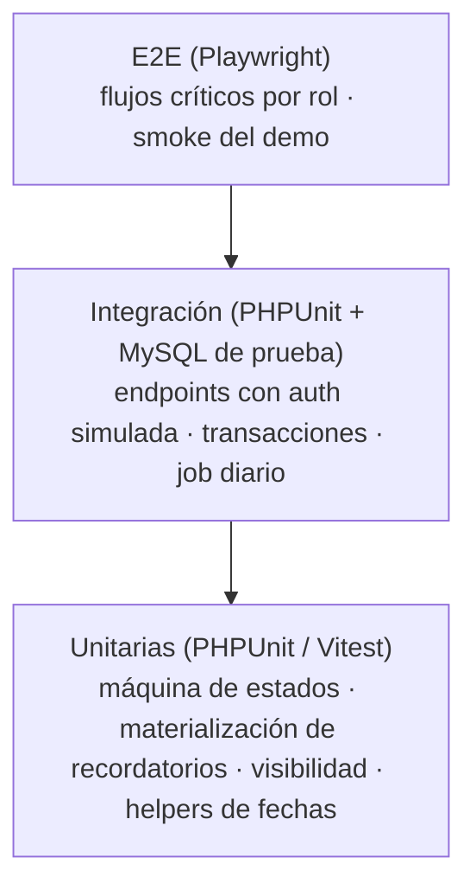

# 06 — Plan de Pruebas

| Campo | Valor |
|---|---|
| Documento | 06 — Plan de Pruebas |
| Versión | 1.0 |
| Fecha | 2026-07-08 |
| Depende de | 01_SRS, 03_modelo_de_datos, 04_plan_de_seguridad, 05_api |

## 1. Pirámide de pruebas

Herramientas: backend PHPUnit (feature tests de CI4 con BD efímera y trait `DatabaseTestTrait`); frontend Vitest + Testing Library; E2E Playwright contra el demo (mock) en Sprint D y contra API real al cierre de Fase 2. Datos de prueba: **el mismo `db.json`** del demo, sembrado por `InitialSeeder` (una sola fuente, Gobernanza v3).

## 2. Casos por módulo

### 2.1 Máquina de estados (exhaustiva — RF-05)

| ID | Caso | Esperado |
|---|---|---|
| ME-01 | Captura de acuerdo | estado `en_proceso`; sin `concluido_por/at` |
| ME-02 | Job diario con `fecha_compromiso < hoy` y `en_proceso` | pasa a `vencido` |
| ME-03 | Job diario con acuerdo `concluido` vencido en fecha | NO cambia |
| ME-04 | Avance con `nueva_fecha` futura sobre `vencido` | regresa a `en_proceso`; recordatorios regenerados |
| ME-05 | Avance sin `nueva_fecha` sobre `vencido` | sigue `vencido` |
| ME-06 | Avance con `nueva_fecha` pasada | 422 |
| ME-07 | Dirección concluye `en_proceso` | `concluido` + autor/fecha + avance tipo `validacion` |
| ME-08 | Dirección concluye `vencido` | `concluido` |
| ME-09 | Dirección concluye `concluido` | 409 |
| ME-10 | Dirección reabre `concluido` | `en_proceso` (o `vencido` tras job si fecha pasada); nota obligatoria |
| ME-11 | Cliente envía `estado` en POST/PATCH | 422 `campo_no_permitido` |
| ME-12 | Coordinador/responsable/corresponsable intenta concluir | **403** + registro en auditoría |

### 2.2 Autorización y visibilidad (A01 — negativos obligatorios)

| ID | Caso | Esperado |
|---|---|---|
| AU-01 | Responsable lista acuerdos | solo propios (responsable o corresponsable) |
| AU-02 | Responsable pide por id un acuerdo ajeno | 404 |
| AU-03 | Coordinador lista | su área + participaciones propias |
| AU-04 | Coordinador edita acuerdo de otra área | 403 |
| AU-05 | Corresponsable registra avance | 200 |
| AU-06 | Corresponsable edita responsable/área | 403 |
| AU-07 | No-dirección accede a `/checklist`, `/usuarios` POST/PATCH, `PUT /configuracion/recordatorios` | 403 |
| AU-08 | Token expirado / firma inválida / aud incorrecto | 401 |
| AU-09 | Token válido de email no registrado | 403 `usuario_no_registrado` |
| AU-10 | Usuario desactivado con token vigente | 403 en ≤60 s |

### 2.3 Captura de lote (RF-02)

LT-01 lote válido de 3 → 201 y 3 ids; LT-02 lote con renglón inválido → 422 y **cero** filas persistidas (verificar rollback de reunión, corresponsables y google_sync); LT-03 corresponsable duplicado o igual al responsable → 422; LT-04 captura concurrente de dos usuarios → ambas persisten sin interferencia; LT-05 `recordatorio_dias` inválido (`[40]`, no-array) → 422.

### 2.4 Recordatorios (RF-08)

RE-01 config default `[7,3,1]`+día D genera 4 envíos por destinatario; RE-02 override `[5,1]` ignora el global; RE-03 destinatarios = responsable + todos los corresponsables; RE-04 re-ejecutar el job el mismo día no duplica (UNIQUE natural); RE-05 acuerdo concluido no genera envíos; RE-06 reprogramación regenera futuros y cancela obsoletos; RE-07 fallo de Gmail API → registro `fallido` con error y el job continúa; RE-08 seguimiento de vencido respeta `vencido_cada_dias`/`max_repeticiones`; RE-09 cambiar default global no altera overrides existentes; RE-10 resumen periódico agrupa por ámbito del rol.

### 2.5 Sincronización Calendar (RF-09)

GC-01 captura crea `google_sync` pendiente y el job crea evento (guarda `calendar_event_id`); GC-02 reprogramación mueve el evento (patch, no duplica); GC-03 conclusión renombra `[Concluido]`; GC-04 error de API → estado `error`, reintenta hasta 3; GC-05 idempotencia: job re-ejecutado con todo sincronizado no llama a la API.

### 2.6 Panel, calendario y filtros (RF-03/04)

PA-01 default oculta concluidos; PA-02 filtro estado=concluido los muestra; PA-03 búsqueda por texto en tema+acción+responsable; PA-04 stats coinciden con la lista visible; PA-05 `GET /calendario` agrupa por día en TZ Juárez (caso borde: medianoche UTC ≠ día local — regresión del bug BQS); PA-06 día con >3 acuerdos colapsa a "+N más" (front).

### 2.7 Administración (RF-10)

**Usuarios:** AD-01 alta con email duplicado → 422; AD-02 desactivar al último dirección activo → 422; AD-03 baja lógica conserva acuerdos históricos; AD-04 usuario desactivado desaparece de selects de responsable.

**Áreas (ADR-004):** AR-01 Dirección crea área válida → 201; AR-02 nombre duplicado → 422 `campos.nombre`; AR-03 Dirección edita área (nombre/`activa`) → 200; AR-04 rol no-Dirección intenta `POST`/`PATCH /areas` → 403.

## 3. Casos negativos OWASP (doc 04)

| ID | Ataque simulado | Esperado |
|---|---|---|
| OW-01 | SQLi en `q` (`'; DROP TABLE--`, `" OR 1=1`) | 200 con búsqueda literal; sin error SQL |
| OW-02 | XSS almacenado en `accion`/`observaciones` (`<script>`, ``) | Persistido como texto; render escapado en SPA y en plantilla de correo |
| OW-03 | IDOR incremental (barrido de ids ajenos) | 404 constante; rate limit activo |
| OW-04 | CORS desde origen no listado | Sin headers CORS; navegador bloquea |
| OW-05 | 429 por ráfaga >60 req/min | 429 + `Retry-After` |
| OW-06 | `enlace` con `javascript:` o esquema no http(s) | 422 |
| OW-07 | Token de otro proyecto Firebase (aud ajeno) | 401 |
| OW-08 | Payload con campos extra (`estado`, `concluido_por_id`) | 422 `campo_no_permitido` |

## 4. Umbrales de rendimiento

| Métrica | Umbral | Método |
|---|---|---|
| `GET /acuerdos` (5,000 filas, per_page 200) | p95 < 500 ms | k6, 10 VU × 2 min |
| `GET /acuerdos/{id}` con 50 avances | p95 < 300 ms | k6 |
| `POST /acuerdos/lote` (20 acuerdos) | p95 < 800 ms | k6 |
| Job diario (500 abiertos, 100 envíos) | < 5 min | ejecución cronometrada |
| Consultas por request en listado | Sin N+1 (nº de queries constante al crecer filas) | contador de queries de CI4 en test de integración |
| Bundle inicial del SPA | < 350 KB gzip | `vite build --report` |

## 5. Matriz de trazabilidad RF ↔ casos

| RF | Casos |
|---|---|
| RF-01 Autenticación | AU-08..10, OW-07 |
| RF-02 Captura lote | LT-01..05, OW-02, OW-06 |
| RF-03 Panel | PA-01..04, AU-01..03 |
| RF-04 Calendario | PA-05..06 |
| RF-05 Estados | ME-01..12 |
| RF-06 Checklist | ME-07..10, ME-12, AU-07 |
| RF-07 Avances | ME-04..06, AU-05..06 |
| RF-08 Recordatorios | RE-01..10 |
| RF-09 Calendar sync | GC-01..05 |
| RF-10 Usuarios/áreas | AD-01..04 (usuarios) · AR-01..04 (áreas, ADR-004) |
| RF-11 Resumen | RE-10, PA-04 |
| RF-12 Auditoría | ME-07/10/12 (verifican inserción en `auditoria`) |

## 6. Criterios de aceptación para release

Fase 1 (Sprint D): typecheck y lint verdes; Vitest de lógica portada (estados, visibilidad, recordatorios en mock) verde; smoke E2E de los flujos por rol sobre el mock; verificación ejecutable `db.json`↔DDL sin discrepancias. Fase 2: 100% de casos ME/AU/OW verdes; cobertura de Services ≥ 80% líneas (`phpunit --coverage-text`); umbrales §4 cumplidos; `composer audit`/`npm audit` sin críticos; checklist DoD Fase 2 de Gobernanza v3 firmada en README.
