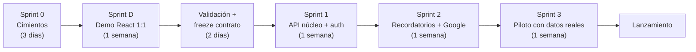

# 07 — Roadmap por Sprints

| Campo | Valor |
|---|---|
| Documento | 07 — Roadmap por Sprints |
| Versión | 1.0 |
| Fecha | 2026-07-08 |
| Depende de | 01_SRS, 02_arquitectura, 06_plan_de_pruebas |

Principio: **cimientos de seguridad antes que funcionalidades**; y por Demo-First v2, el demo React (Sprint D) va antes que cualquier backend. El demo vanilla ya validado por dirección reduce el riesgo de UX del Sprint D a la fidelidad de conversión.

## Sprint 0 — Cimientos (Fase 0→1, 3 días)

Monorepo (`demo-ux/`, futura `apps/`), `.gitignore` con `.env`/claves desde el primer commit; `docker-compose.yml` (mysql:8.4 + redis:7); proyecto Firebase creado (proveedores Google + email/password habilitados); proyecto Google Cloud con Gmail/Calendar APIs habilitadas y service account creada (sin clave en repo); DDL doc 03 aplicado en el MySQL local; `db.json` espejo generado y verificado contra el DDL. **Hito:** entorno reproducible con un comando; docs 00–08 completos (DoD Fase 0).

## Sprint D — Demo React 1:1 (Fase 1, 1 semana)

Conversión pixel-perfect del demo aprobado a React+Vite+Tailwind con `db.json` detrás de `lib/api.ts` (mock): login (ahora con pantalla Firebase simulada en mock), panel con tabla/kanban/reunión/gantt, captura doble (formularios/hoja), recordatorios con vista previa de correo, drawer, resumen, usuarios; **más lo nuevo aprobado:** vista calendario, checklist de Dirección, corresponsables en captura/detalle, estados v2 (En proceso/Vencido/Concluido, concluidos ocultos por default), recordatorios configurables (global + override). Estados de componentes completos (default/hover/focus/disabled/loading/empty/error), WCAG 2.1 AA, responsive. **Hito (DoD Fase 1):** stakeholder recorre los flujos sin backend; typecheck+lint+Vitest verdes; verificación ejecutable `db.json`↔DDL sin discrepancias.

## Validación y freeze (2 días)

Sesión con dirección/Mariel usando el demo React; bitácora hallazgos→cambios en doc 09; re-sincronizar SRS(01) y API(05); **doc 05 pasa a contener la interfaz literal de `api.ts` y se marca CONGELADA** (Gobernanza v3 §4).

## Sprint 1 — API núcleo + auth (Fase 2, 1 semana)

Migraciones + `InitialSeeder` desde `db.json`; `FirebaseAuthFilter` + verificación JWKS con Redis; CORS/Throttle/headers; endpoints: `/me`, `/acuerdos` (listado/detalle/lote/edición/corresponsables/avances), `/usuarios`, `/areas`, `/checklist`, `/calendario`, `/resumen`; Policies con pruebas negativas (AU-01..10); `api.real.ts` en el front y pruebas de humo con `VITE_USE_MOCK=false`. **Hito:** los 3 roles operan el flujo completo contra API real en staging.

## Sprint 2 — Recordatorios + Google (1 semana)

Comando `spark recordatorios:procesar` (vencidos → materialización → Gmail → Calendar → resumen) + cron; `GmailService` y `GoogleCalendarService` idempotentes con reintentos; endpoints de configuración de recordatorios; plantillas de correo (1:1 con la vista previa del demo); domain-wide delegation gestionada con Dirección. **Hito:** correo real recibido según esquema `[7,3,1]` y evento visible en el calendario compartido; RE-01..10 y GC-01..05 verdes.

## Sprint 3 — Piloto con datos reales (1 semana)

Carga de acuerdos de 2–3 reuniones reales (Fase 4 de la propuesta); ajustes de la bitácora; rendimiento §4 doc 06; `composer/npm audit`; hardening del despliegue (checklist doc 04); capacitación breve a capturistas; promoción `demo-ux/app` → `apps/web` (borrar mock). **Hito (DoD Fase 2, Gobernanza v3 §3):** checklist completa firmada en README — cero N+1 auditado, Policies con negativos, seeder desde `db.json` sin transformación, cobertura ≥80%, OWASP re-verificado, transacciones confirmadas, `api.ts` ≡ doc 05.

## Riesgos y mitigaciones

| Riesgo | Prob. | Impacto | Mitigación |
|---|---|---|---|
| Domain-wide delegation demora (depende de superadmin) | Media | Bloquea Sprint 2 | Gestionar en Sprint 0; plan B: refresh token OAuth de la cuenta central |
| La conversión 1:1 revela deudas del demo (estados nuevos vs. diseño) | Media | Retrabajo UI | H-01 ya documenta el delta; validar kanban de 2 columnas con Mariel al inicio del Sprint D |
| Cupos/verificación OAuth de Google (app interna) | Baja | Correos no salen | App marcada "Internal" en Workspace: sin revisión de Google |
| Piloto revela cambios de contrato tras el freeze | Media | Re-freeze | Cambios pasan por ADR corto + actualización simultánea api.ts↔doc05 (regla №3) |
| Un solo desarrollador (bus factor) | Alta | Continuidad | Esta documentación + CLAUDE.md permiten retomar con agente IA sin arranque en frío |

## Backlog post-MVP

Google Tasks por usuario (OAuth incremental, ADR-003); integración tablero de metas (H-10); attendees nativos en eventos de Calendar; exportes PDF/XLSX del resumen; notificaciones in-app; archivado anual de acuerdos concluidos.
