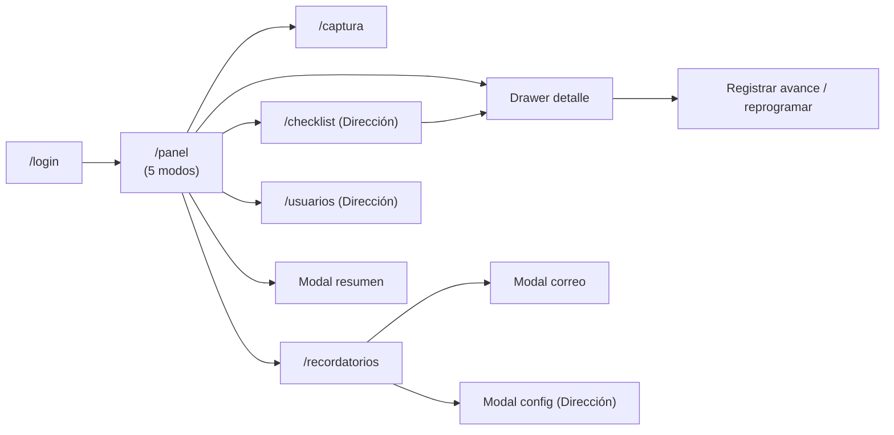

# 09 — Guía del Demo UX (React)

| Campo | Valor |
|---|---|
| Documento | 09 — Guía del Demo UX |
| Versión | 1.0 |
| Fecha | 2026-07-08 |
| Depende de | 01_SRS, 03_modelo_de_datos, 05_api, 08_design_system |

## 1. Propósito y alcance

Conversión **1:1** del demo vanilla aprobado por dirección a React 19 + Vite + Tailwind 4, consumiendo `db.json` espejo del DDL (doc 03) detrás de `lib/api.ts`, más las funciones nuevas aprobadas: vista calendario, checklist de Dirección, corresponsables, máquina de estados v2 y recordatorios configurables. Este prototipo ES el frontend de producción (`demo-ux/app/` → `apps/web/` en Fase 2, sin retrabajo).

## 2. Inventario de pantallas

| Pantalla | Requisito SRS | Ruta | Roles |
|---|---|---|---|
| Login (selector demo → luego Firebase) | RF-01 | `/login` | Público |
| Panel — Tabla | RF-03 | `/panel` (modo tabla) | Todos |
| Panel — Tarjetas (kanban) | RF-03 | `/panel` (modo tarjetas) | Todos |
| Panel — Por reunión | RF-03 | `/panel` (modo reunión) | Todos |
| Panel — Cronograma (gantt) | RF-03 | `/panel` (modo gantt) | Todos |
| **Panel — Calendario** (nuevo) | RF-04 | `/panel` (modo calendario) | Todos |
| Drawer de detalle (corresponsables + avances) | RF-03.5, RF-07 | overlay sobre `/panel` | Según visibilidad |
| Captura — Formularios / Hoja | RF-02 | `/captura` | Todos |
| Recordatorios (próximos/historial/preview correo + **config**) | RF-08 | `/recordatorios` | Todos (config solo Dirección) |
| **Checklist de validación** (nuevo) | RF-06 | `/checklist` | Solo Dirección |
| Usuarios y permisos | RF-10 | `/usuarios` | Solo Dirección |
| Modal resumen periódico | RF-11 | overlay | Dirección/Coordinación |

## 3. Mapa de navegación

Topbar idéntica al demo: logo blanco sobre morado, tabs por rol (Panel · Capturar · Recordatorios · [Checklist] · [Usuarios]), usuario + Salir.

## 4. Catálogo de estados por componente

Todos los componentes del doc 08 §6 implementan default/hover/focus/disabled/loading/**empty/error**. Empty states obligatorios: panel sin acuerdos visibles, calendario sin acuerdos en el mes, recordatorios sin envíos, checklist sin pendientes, resultados de búsqueda vacíos. Error states: fallo de guardado de lote (banner + filas resaltadas — 1:1 con demo), fallo de carga (retry).

## 5. Espejo de datos (`src/lib/mock/db.json`)

Reglas (Demo-First v2 + Gobernanza v3 §5): una clave de nivel superior por tabla del DDL (`areas`, `usuarios`, `reuniones`, `acuerdos`, `acuerdo_corresponsables`, `avances`, `configuracion`, `recordatorios_enviados`, `google_sync`, `usuario_google_tokens`, `auditoria`); columnas exactas; enums solo con valores válidos; FKs íntegras; fechas fijas ISO; correos `@demo.test`, nombres ficticios (H-05). El mock re-basa fechas a "hoy" en memoria para conservar escenarios vivos (H-06) sin tocar el archivo. Cobertura: caminos felices + estados vacíos + acuerdo vencido + concluido + usuario desactivado + envío fallido + sync en error (no solo camino feliz). Doble uso: siembra MySQL en Fase 2 vía `InitialSeeder`.

## 6. Accesibilidad

WCAG 2.1 AA verificada contra doc 08 §3: navegación completa por teclado (tabs, drawer con trap de foco y Esc, modales), `aria-label` en iconos, roles semánticos (`table`, `dialog`, `tablist`), focus visible morado 500, estados no comunicados solo por color.

## 7. Responsive

Breakpoints doc 08 §5. Tabla → scroll horizontal <768px; kanban → columnas apiladas <640px; calendario → lista agrupada por día <640px; captura hoja → recomendación de vista formularios en móvil (banner).

## 8. Protocolo de validación

Sesión con dirección + Mariel recorriendo por rol: (Dirección) login → panel → checklist → concluir → verificar que desaparece del panel → reabrir → config de recordatorios → usuarios; (Coordinación) captura de lote con corresponsables → drawer → avance con reprogramación de un vencido; (Responsable) panel propio → calendario → recordatorios → preview de correo. Registrar cada hallazgo en §9 y clasificarlo (bloqueante / mejora / post-MVP).

## 9. Bitácora hallazgos → cambios

| # | Fecha | Hallazgo | Clasificación | Cambio aplicado | Estado |
|---|---|---|---|---|---|
| 1 | 2026-07-10 | Stakeholder solicita rediseñar el Login: dos secciones (introducción de la app + acceso), elegante, identidad Participa Juárez | Mejora | Login split: panel de marca (degradado morado, logo blanco, titular Fredoka, ciclo de vida del acuerdo como motivo) + panel de acceso claro con el form existente. Sin cambios de lógica de auth. | ✅ Aplicado |
| — | — | *(pendiente de sesión de validación)* | — | — | — |
